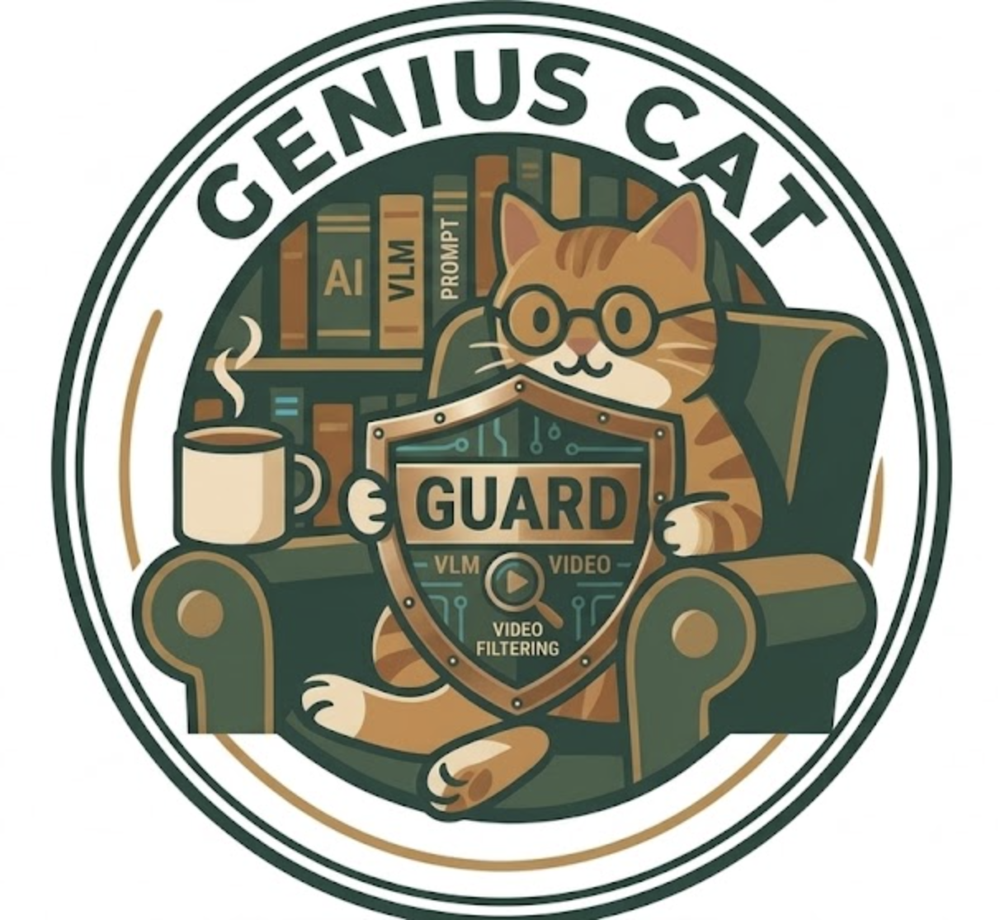

<h1 align="center">GUARD</h1>

  <strong>Generalized User Prompt Adaptive Real-time Filtering & Detection</strong> 
  심리적 취약계층을 위한 VLM 기반 영상 필터링 시스템

  

> GUARD는 영상 전체를 무겁게 처리하는 대신, 핵심 프레임과 중요한 토큰만 선별해 VLM에 전달함으로써  
> **개인화된 영상 필터링**과 **실시간성에 가까운 추론 효율**을 함께 달성하는 것을 목표로 합니다.

## About Project

| 항목 | 내용 |
| --- | --- |
| 목표 | 사용자 프롬프트 기반 영상 필터링 및 탐지 |
| 문제의식 | 기존 필터링은 일반 유해성 판정에 치우쳐 있어 개인별 민감 요소를 충분히 반영하지 못함 |
| 핵심 접근 | `frame selection` + `token selection` + `VLM inference` |
| 대상 사용자 | 시각 자극에 민감한 사용자, 심리적 취약계층, 사용자 보호가 필요한 플랫폼 |
| 기대 산출물 | 실험 가이드라인, 분석 결과, 데모 또는 서비스 프로토타입 |

## Prompte Based Video Filtering

기존 영상 플랫폼의 필터링은 폭력성, 선정성, 연령 제한처럼 일반적인 유해성 판단에 집중되는 경우가 많습니다. 하지만 실제 사용자 중에는 특정 동물, 곤충, 폐쇄 공간, 의료 장면, 피와 같은 요소에 강한 불안이나 거부 반응을 보이는 경우가 있으며, 이런 개인별 민감 요소는 기존 규칙 기반 필터링만으로는 충분히 대응하기 어렵습니다.

GUARD는 이러한 한계를 줄이기 위해, 영상 프레임과 자연어 프롬프트를 함께 해석하는 VLM 기반 의미 분석 방식을 적용합니다. 단순히 키워드를 차단하는 것이 아니라, 사용자가 피하고 싶은 장면이 실제 영상 속에 존재하는지를 **장면 맥락 단위로 해석**하는 것이 이 프로젝트의 핵심입니다.

## Psychologically Vulnerable Groups

| 대상 | 설명 |
| --- | --- |
| 특정 시각 자극에 민감한 사용자 | 특정 동물, 곤충, 피, 의료 장면, 폐쇄 공간 등에 불편함을 느끼는 사용자 |
| 심리적 취약계층 | PTSD, 공포증, 불안 반응 등으로 특정 장면을 회피해야 하는 사용자 |
| 정서적 민감군 | 우울하거나 자극적인 분위기의 콘텐츠를 사전에 걸러내고 싶은 사용자 |
| 플랫폼 운영자 | 사용자 보호와 시청 경험 개선이 필요한 영상 서비스 운영 주체 |

즉, GUARD는 단순한 유해 콘텐츠 차단 도구가 아니라, **사용자별 민감도를 반영한 능동적 시청 환경**을 제공하기 위한 프로젝트입니다.

## Why VLM?

기존 서비스인 `YouTube Kids`, `ClearPlay`, `YT-Block`은 각각 플랫폼 정책, 타임코드 기반 재생 제어, 키워드/메타데이터 기반 차단이라는 장점을 갖고 있지만 아래와 같은 한계도 함께 가집니다.

| 기존 방식의 한계 | GUARD의 대응 방향 |
| --- | --- |
| 키워드 기반 필터링은 맥락을 이해하지 못함 | 영상 프레임과 텍스트를 함께 해석하는 의미 기반 분석 |
| 메타데이터 기반 분류는 실제 장면을 충분히 설명하지 못함 | 장면 자체를 직접 해석하는 VLM 기반 판별 |
| 사전 정의된 규칙은 사용자별 민감 기준 반영이 어려움 | 사용자 프롬프트 중심의 개인화 필터링 |
| 영상 전체 프레임 처리 방식은 연산량이 큼 | frame/token selection을 통한 추론 비용 절감 |

### Difference

1. 키워드 매칭이 아닌 **VLM 기반 의미 분석**을 지향합니다.
2. 실시간 또는 준실시간 필터링을 위해 **연산 최적화**를 핵심 연구 축으로 둡니다.
3. 플랫폼 중심 제어가 아니라 **사용자 프롬프트 중심 개인화 필터링**을 설계합니다.
4. `frame selection`과 `token selection`을 함께 비교해 실제 서비스에 적합한 효율-성능 균형점을 찾습니다.

## Experiment Goal

이 프로젝트는 아래 질문에 답하는 것을 목표로 합니다.

- 영상 길이에 따라 어떤 `frame selection` 방식이 가장 효율적인가
- `token selection` 또는 `token compression`이 추론 속도와 성능에 어떤 영향을 주는가
- `frame selection`과 `token selection`의 조합 중 어떤 구성이 가장 실용적인가
- 영상 길이와 작업 종류에 따라 최적 조합을 자동으로 추천할 수 있는가

최종적으로는 **영상 길이에 따른 최적 filtering/inference 조합 가이드라인**을 도출하는 것이 목표입니다.

## Experiment Load-map

| 구분 | 핵심 아이디어 | 확인하려는 내용 |
| --- | --- | --- |
| Base | 전체 영상에서 균등 간격 프레임 샘플링 | 기준선 성능과 속도 확보 |
| AFS | 수치 기반 샘플링으로 프레임 중복 제거 | 불필요 프레임 감소 효과 |
| KTV | key frame + key token selection | 프레임/토큰 동시 최적화 가능성 |
| AIM | 멀티모달 LLM 입력 토큰 압축 | attention 비용 절감 효과 |
| Stage1 vs Stage2 | frame selection과 token 절약 조합 비교 | 가장 실용적인 최적화 조합 탐색 |

### 1. Base

- 전체 영상에서 동일한 시간 간격으로 프레임을 선택하는 균등 샘플링을 사용합니다.
- 영상 길이에 따른 성능 변화와 추론 속도 변화를 기록합니다.
- 이후 실험군을 비교하는 기준선으로 활용합니다.

### 2. AFS

- `Adaptive Frame Sampling`
- 수치 기반 샘플링으로 프레임 중복을 줄이는 방식입니다.
- 균등 샘플링 이후 유사하거나 불필요한 프레임을 제거하는 방향을 검토합니다.

### 3. KTV

- `Keyframe & Token Selection for VLM`
- 클러스터링 기반으로 중복 프레임을 줄이고, 프레임 중요도와 패치 중복성을 함께 평가합니다.
- frame redundancy 제거와 token 관점의 효율화가 동시에 가능한지 확인합니다.

### 4. AIM

- `Adaptive Inference of Multi-Modal LLMs`
- 이미지 인코더가 생성한 패치 시퀀스를 압축해 LLM attention 비용을 줄이는 방향의 실험입니다.
- token compression이 영상 분류 및 캡셔닝 속도에 주는 영향을 측정합니다.

### 5. Stage1 vs Stage2

- Stage 1: `frame selection`
- Stage 2: `token saving` 또는 `LLM/KV cache` 기반 가속

각 단계별 최적화 방식을 단독 또는 조합으로 비교해, 어떤 조합이 가장 높은 효율을 내는지 분석합니다.

## Benchmark

- 기존 영상 질의응답 벤치마크인 `MVBench`, `NeXTQA` 등을 활용합니다.
- 질의응답 문제를 `yes/no` 이진 분류 쌍으로 재구성해 랜덤 정답 편향을 줄이는 방향을 고려합니다.
- 단순 정확도뿐 아니라 추론 속도와 계산 비용을 함께 평가합니다.

### Time Metric

| 지표 | 설명 |
| --- | --- |
| `Frame Selection Time` | VLM 입력용 프레임을 선택하는 데 걸리는 시간 |
| `VLM Computing Time` | 영상 분석 및 응답 생성에 걸리는 시간 |
| Task Performance | VQA, 분류, 캡셔닝 등에서의 응답 품질 |

## Reference

1. J. Yoon and M.-K. Choi, "Exploring Video Frame Redundancies for Efficient Data Sampling and Annotation in Instance Segmentation," CVPRW, 2023.
2. Z. Wang et al., "Reasoning-Enhanced Domain-Adaptive Pretraining of Multimodal Large Language Models for Short Video Content Governance," EMNLP Industry Track, 2025.
3. B. Song et al., "KTV: Keyframes and Key Tokens Selection for Efficient Training-Free Video LLMs," AAAI, 2026.
4. D. Bolya et al., "Token Merging: Your ViT But Faster," ICLR, 2023.
5. Chandra et al., "Reducing Risks Posed by Synthetic Content: An Overview of Technical Approaches to Digital Content Transparency," NIST, 2024.
6. UNESCO, "Guidelines for the Governance of Digital Platforms," 2023.
7. D. Kiela et al., "The Hateful Memes Challenge: Detecting Hate Speech in Multimodal Memes," NeurIPS, 2020.
8. YouTube, "Set your channel or video's audience," 2023.
9. YouTube Kids, "Important information for parents," 2023.
